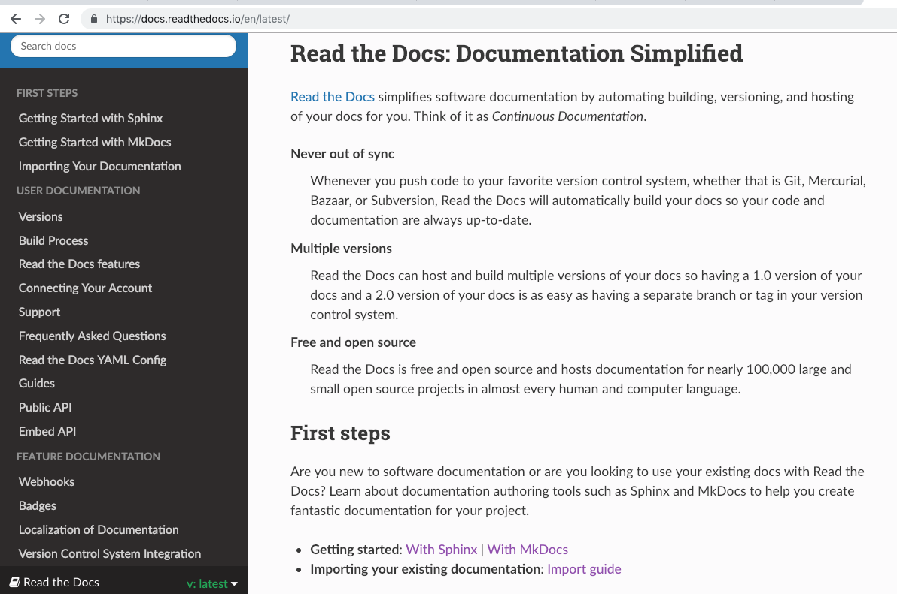
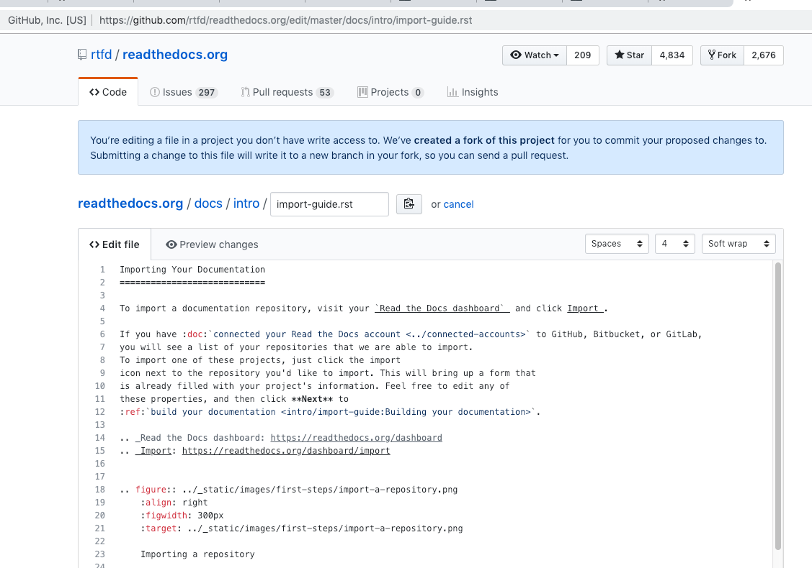
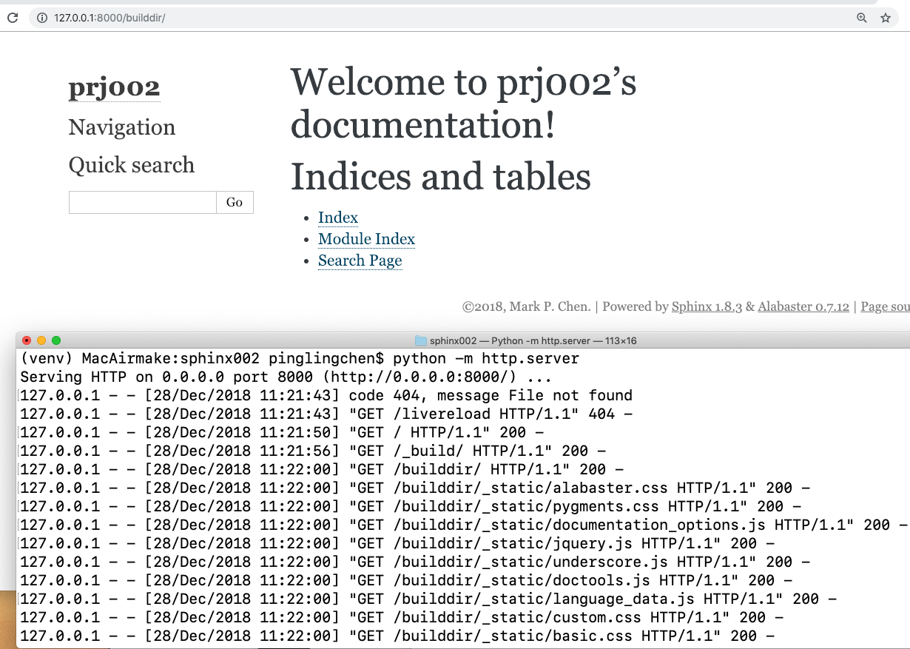
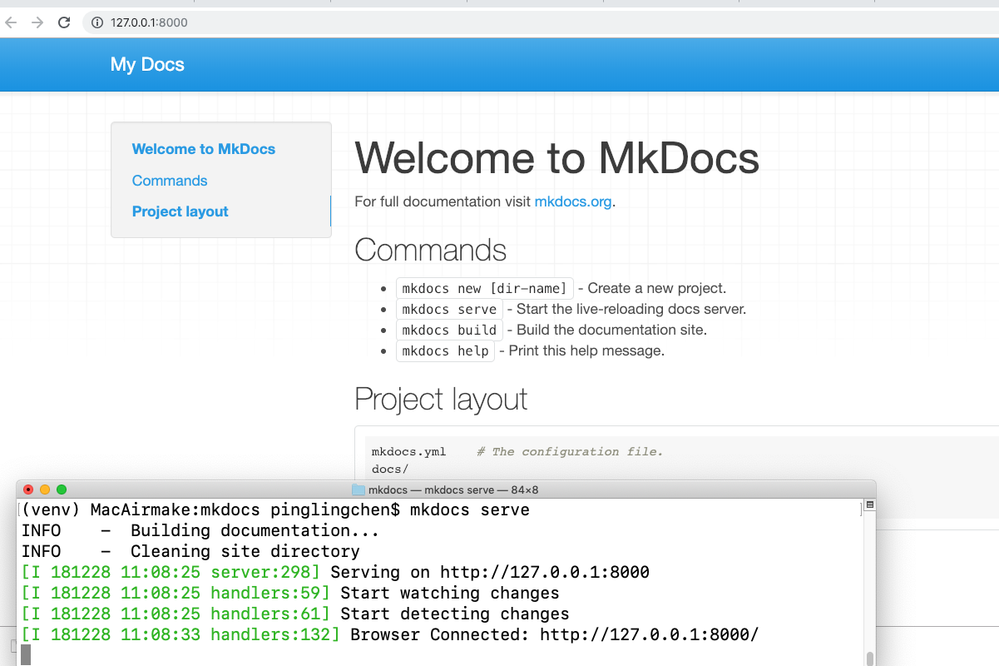

Starting from official website
====================

The online doc of this is
https://2019-chenpingling.readthedocs.io/en/latest/

Choose the first available template

    
    

Online doc on readthedocs is
https://bootstrap-datepicker.readthedocs.io/en/latest/

The source is on GitHub

    

Learning by doing
====================
Choose the first available template

.. figure:: _static/screenshots/index/03.png
    :align: center

Online doc on readthedocs is
https://bootstrap-datepicker.readthedocs.io/en/latest/

And the source is 
https://github.com/uxsolutions/bootstrap-datepicker/edit/master/docs/index.rst

2019-chenpingling
====================

2019-chenpingling is my playground to practice readthedocs.io.

At first I did it on my local Mac, for both:

*`With Sphinx`_ 

.. _With Sphinx: https://docs.readthedocs.io/en/latest/intro/getting-started-with-sphinx.html

*`With MkDocs`_  

.. _With MkDocs: https://docs.readthedocs.io/en/latest/intro/getting-started-with-mkdocs.html
    

Table of Contents
-----------------

.. toctree::

   markup
   options
   methods
   events
   keyboard
   i18n
